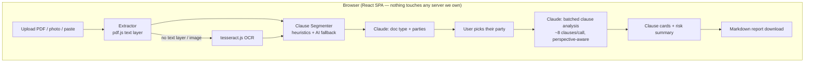

# ClauseLens — AI Contract & Policy Analyzer

**Version:** 1.0 (V1 spec) · **Author:** Ajay Kumar

---

## 1. What this is

Upload any contract — rental agreement, ToS, insurance policy, employment offer, freelance
contract — as a PDF, photo/scan, or pasted text. ClauseLens:

1. Extracts the text (PDF text layer, or OCR for scans/photos)
2. Detects the document type and the parties involved
3. Asks **which party you are** (tenant vs landlord changes everything)
4. Segments the document into clauses and analyzes each one from *your* perspective:
   - Risk level (🔴 red flag / 🟡 caution / 🟢 standard / ⚪ informational)
   - Plain-English translation
   - "Unusual vs standard" — is this clause typical for this document type?
   - Negotiation tip / question to ask before signing
5. Produces an overall risk summary + top red flags + a downloadable report

**Not legal advice** — prominent disclaimer throughout. It's a reading aid that helps people
understand what they're signing and what to ask a professional about.

## 2. Design decisions

| Decision | Choice | Rationale |
|---|---|---|
| Scope | Any contract type | AI detects type; prompts adapt per type |
| Input | PDF + image/photo + paste text | pdf.js text layer → tesseract.js OCR fallback → textarea |
| Extraction | Fully client-side | Privacy is the selling point: the document only ever goes to the AI API, never a middle server |
| AI | Claude API (`claude-sonnet-4-6`) | Type detection, clause analysis, perspective-aware risk |
| Clause segmentation | Heuristic splitter first (numbered sections, headings), AI fallback | Cheap + deterministic; AI only when structure is messy |
| Analysis batching | ~8 clauses per API call with doc-context header | Token-efficient, streams results progressively |
| Perspective toggle | User picks their party after detection | The same clause is a red flag for a tenant and a win for a landlord |
| Build | Vite + React zip | Real repo, real libs (pdf.js, tesseract.js) |

## 3. Architecture

## 4. AI passes

**Pass 0 — Document profile** (first ~4,000 chars): returns
`{docType, parties: [{name, role}], likelyUserRole, jurisdictionHints}`.

**Pass 1..N — Clause batches**: each call gets the doc profile + user's party + 8 clauses,
returns per clause: `{risk, plainEnglish, isUnusual, whyUnusual, negotiationTip}`. Results
stream into the UI as each batch lands — user reads early clauses while later ones analyze.

**Final — Executive summary**: overall risk grade, top 3 red flags, questions-before-signing
checklist.

## 5. Failure handling

| Failure | Behavior |
|---|---|
| Scanned PDF with no text layer | Auto-rasterize pages → OCR pipeline, progress per page |
| OCR gibberish (confidence < threshold) | Warn user, offer paste-text fallback |
| Very long contract (>50 pages) | Analyze in order, cap at configurable clause budget, tell the user what was skipped |
| Claude API error mid-batch | Completed clauses stay; failed batch gets a retry button |
| No API key | Extraction + segmentation still work; analysis panels prompt for key in Settings |

## 6. V2 backlog

Hindi + regional language contracts (OCR langs + analysis), side-by-side contract comparison,
clause library ("show me a fair version of this clause"), shareable report links, WhatsApp
share card generation (India distribution).
